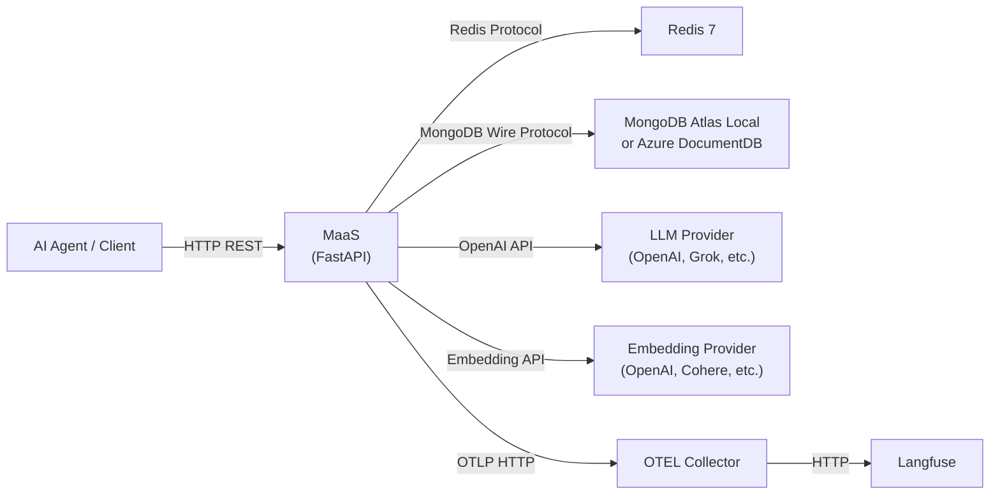
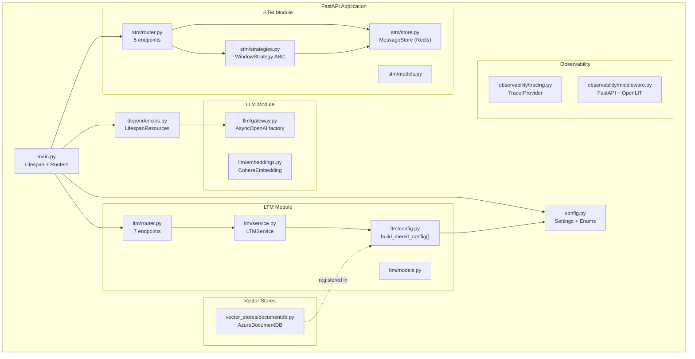
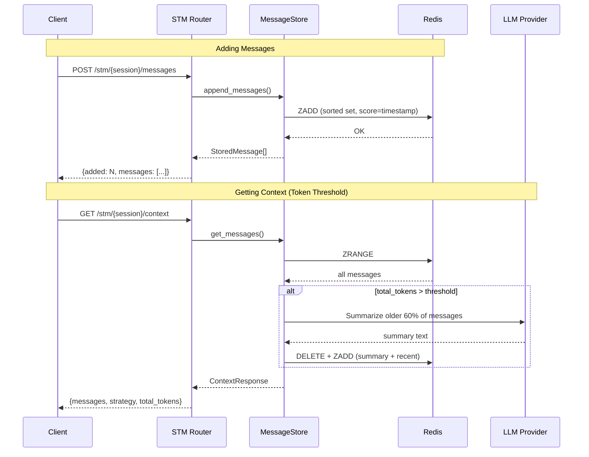
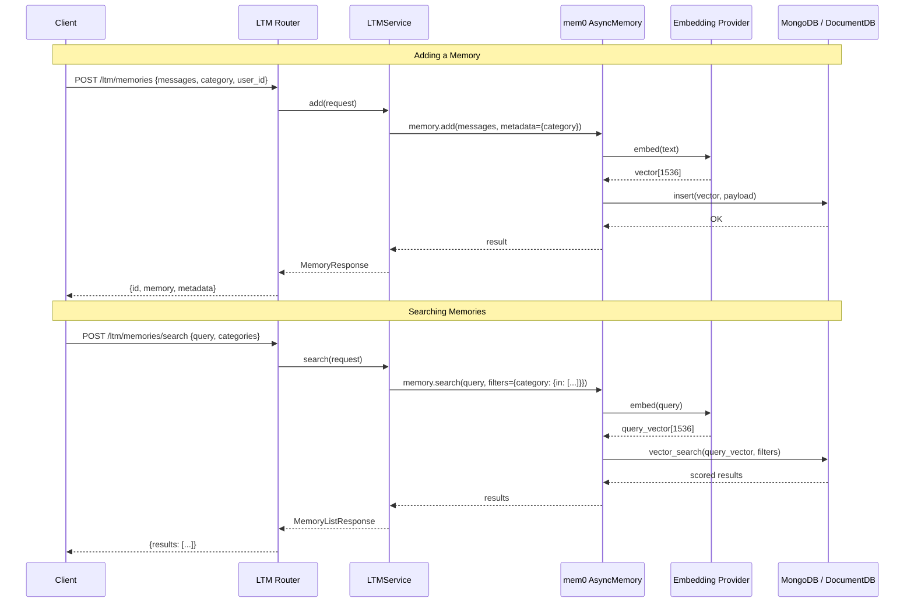
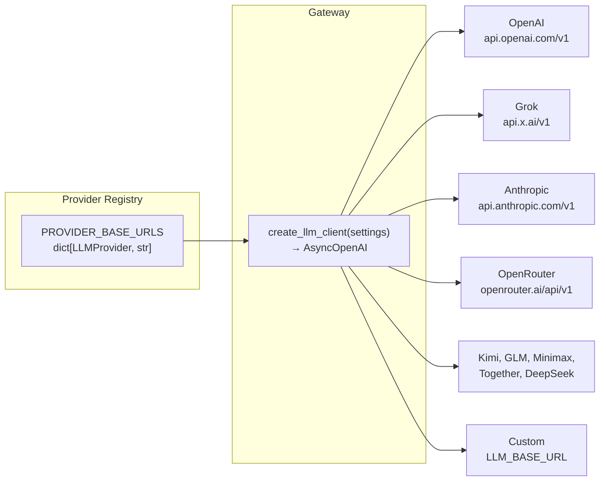
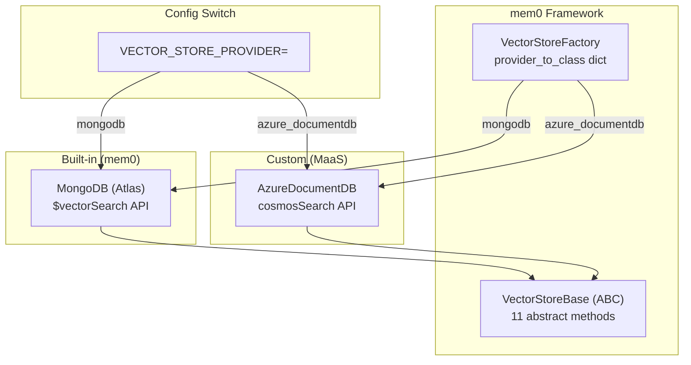
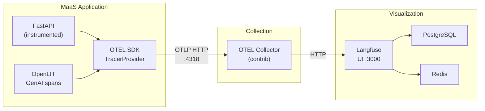
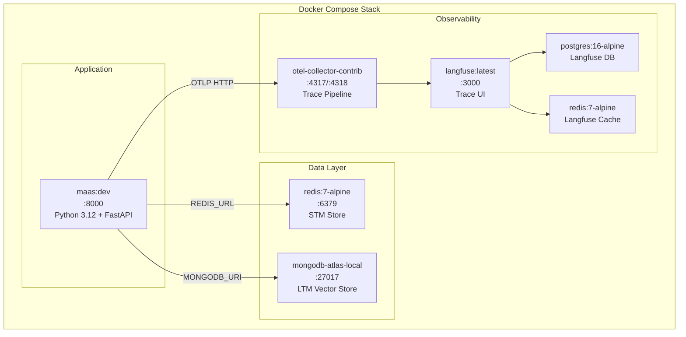

# MaaS — Architecture Document

## System Context



## High-Level Architecture



## Component Details

### 1. Configuration Layer (`config.py`)

Central pydantic-settings configuration loaded from `.env` files.

```
┌─────────────────────────────────────────────────┐
│                    Settings                      │
├─────────────────────────────────────────────────┤
│ LLM:        provider, api_key, model, base_url  │
│ Embedding:  provider, api_key, model, dims      │
│ STM:        redis_url, strategy, max_messages    │
│ LTM:        mongodb_uri, db_name, collection     │
│ OTEL:       endpoint, service_name, langfuse     │
│ Vector:     vector_store_provider                │
├─────────────────────────────────────────────────┤
│ Enums: LLMProvider, EmbeddingProvider,           │
│        STMStrategy, VectorStoreProvider           │
├─────────────────────────────────────────────────┤
│ PROVIDER_BASE_URLS: dict[LLMProvider, str]       │
│ resolved_llm_base_url: property                  │
│ resolved_stm_summarization_model: property       │
└─────────────────────────────────────────────────┘
```

### 2. Short-Term Memory (STM)



**Data Model:**

```
Redis Key: stm:session:{session_id}:messages
Type: Sorted Set
Score: Unix timestamp (float)
Member: JSON-serialized StoredMessage

StoredMessage:
├── id: UUID
├── role: user | assistant | system | summary
├── content: str
├── metadata: dict | null
├── timestamp: float
└── token_count: int
```

**Strategies:**

```
┌──────────────────────────┐     ┌──────────────────────────┐
│   SlidingWindowStrategy  │     │  TokenThresholdStrategy  │
├──────────────────────────┤     ├──────────────────────────┤
│ Keep last N messages     │     │ If tokens > threshold:   │
│ (STM_MAX_MESSAGES)       │     │   Split at 60%           │
│                          │     │   Summarize older portion│
│ No LLM calls             │     │   via LLM                │
│ O(1) Redis operation     │     │   Replace in Redis       │
└──────────────────────────┘     └──────────────────────────┘
```

### 3. Long-Term Memory (LTM)



**Memory Categories (metadata-level differentiation):**

```
┌─────────────┬────────────────────────────────────────────────────────┐
│ Category    │ Purpose                                                │
├─────────────┼────────────────────────────────────────────────────────┤
│ semantic    │ General knowledge and concepts                         │
│ episodic    │ Specific events and interactions                       │
│ fact        │ Verified factual information                           │
│ preference  │ User preferences and settings                          │
└─────────────┴────────────────────────────────────────────────────────┘

All categories share a single vector space in one MongoDB collection.
Filtering happens via metadata payload in mem0's search API.
```

### 4. LLM Gateway



All providers use the **OpenAI Chat Completions API** protocol. The gateway creates a single `AsyncOpenAI` client with the resolved `base_url` for the configured provider.

### 5. Vector Store Architecture



**Atlas vs DocumentDB API Mapping:**

```
┌──────────────────────┬───────────────────────────┬─────────────────────────────┐
│ Operation            │ Atlas (mongodb)            │ DocumentDB (azure_documentdb)│
├──────────────────────┼───────────────────────────┼─────────────────────────────┤
│ Index creation       │ SearchIndexModel +         │ db.command("createIndexes") │
│                      │ create_search_index()      │ with cosmosSearch key type  │
├──────────────────────┼───────────────────────────┼─────────────────────────────┤
│ Index listing        │ list_search_indexes()      │ db.command("listIndexes")   │
├──────────────────────┼───────────────────────────┼─────────────────────────────┤
│ Vector search        │ $vectorSearch stage        │ $search + cosmosSearch      │
├──────────────────────┼───────────────────────────┼─────────────────────────────┤
│ Score metadata       │ $meta: "vectorSearchScore" │ $meta: "searchScore"        │
├──────────────────────┼───────────────────────────┼─────────────────────────────┤
│ CRUD (insert, etc.)  │ Standard pymongo           │ Standard pymongo (same)     │
└──────────────────────┴───────────────────────────┴─────────────────────────────┘
```

### 6. Observability Pipeline



**Span Types:**

```
┌─────────────────────────────────────────────┐
│ HTTP Spans (FastAPIInstrumentor)             │
│  └─ gen_ai.* spans (OpenLIT)                │
│     ├─ LLM completion calls                 │
│     ├─ Embedding calls                      │
│     └─ mem0 operations                      │
└─────────────────────────────────────────────┘
```

### 7. Container Architecture



**Dockerfile Build Stages:**

```
┌──────────────────────────────────────────────┐
│ Stage 1: base                                │
│  python:3.12-slim + uv binary               │
├──────────────────────────────────────────────┤
│ Stage 2: deps                                │
│  COPY pyproject.toml + uv.lock              │
│  RUN uv sync --frozen --no-dev              │
│  (135 packages installed)                    │
├──────────────────────────────────────────────┤
│ Stage 3: runtime                             │
│  COPY .venv from deps stage                 │
│  COPY src/ into /app/src/                   │
│  ENV PYTHONPATH="/app/src"                   │
│  CMD uvicorn maas.main:app                  │
└──────────────────────────────────────────────┘
```

## Data Flow Summary

```
                    ┌─────────────┐
                    │  AI Agent   │
                    └──────┬──────┘
                           │ HTTP
                    ┌──────▼──────┐
                    │   FastAPI   │
                    │   (main)    │
                    └──┬──────┬───┘
                       │      │
              ┌────────▼─┐  ┌─▼────────┐
              │   STM    │  │   LTM    │
              │  Router  │  │  Router  │
              └────┬─────┘  └────┬─────┘
                   │             │
              ┌────▼─────┐  ┌───▼──────┐
              │ Message  │  │  LTM     │
              │  Store   │  │ Service  │
              └────┬─────┘  └───┬──────┘
                   │            │
              ┌────▼─────┐  ┌──▼───────┐
              │  Redis   │  │   mem0   │
              │ (sorted  │  │ Async    │
              │  sets)   │  │ Memory   │
              └──────────┘  └──┬───┬───┘
                               │   │
                    ┌──────────▼┐ ┌▼──────────┐
                    │ Embedder  │ │ Vector    │
                    │ (OpenAI,  │ │ Store     │
                    │  Cohere)  │ │ (MongoDB/ │
                    └───────────┘ │ DocumentDB│
                                  └───────────┘
```

## Security Considerations

- All API keys stored in `.env` (gitignored), never in source code
- Docker Compose overrides connection URLs for container networking
- Azure DocumentDB requires TLS + SCRAM-SHA-256 authentication
- No authentication on the MaaS API itself (assumed to run behind a gateway/mesh)
- Langfuse secrets configured via environment variables
